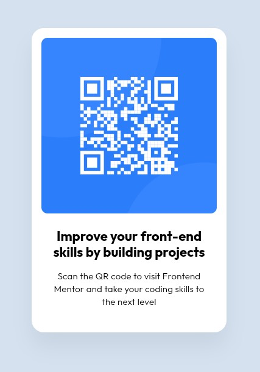

# Frontend Mentor - QR code component solution

This is a solution to the [QR code component challenge on Frontend Mentor](https://www.frontendmentor.io/challenges/qr-code-component-iux_sIO_H).

## Table of contents

- [Overview](#overview)
  - [Screenshot](#screenshot)
  - [Links](#links)
- [My process](#my-process)
  - [Built with](#built-with)
  - [What I learned](#what-i-learned)
  - [Continued development](#continued-development)
  - [Useful resources](#useful-resources)
- [Author](#author)

## Overview

Simple card component. I've tried to replicate figma design as close as I could.
Probably could've been done in a simpler way.
Used fixed size as suggested. No responsive design.

### Screenshot

### Links

- Solution URL: [https://mci3x.github.io/QR-Component/](https://mci3x.github.io/QR-Component/)
- Live Site URL: [https://mci3x.github.io/QR-Component/](https://mci3x.github.io/QR-Component/)

## My process

Started with a HTML and made my way from the top in CSS.
Placed things roughly first then measured every element in Figma and tweaked them until it looked alike :)
Didn't use custom properties and responsive design due to nature of a project.

### Built with

- Semantic HTML5 markup
- Flexbox

### What I learned

Most of all I learned how to use Figma for reference

### Continued development

Proper responsive design practices and custom properties

### Useful resources

MDN Web Docs, Perplexity

## Author

- GitHub - [mci3x](https://github.com/mci3x)
- Frontend Mentor - [@mci3x](https://www.frontendmentor.io/profile/mci3x)
- Bluesky - [@mci3x.bsky.social](https://bsky.app/profile/mci3x.bsky.social)
- X - [@mci3x](https://www.x.com/mci3x)
